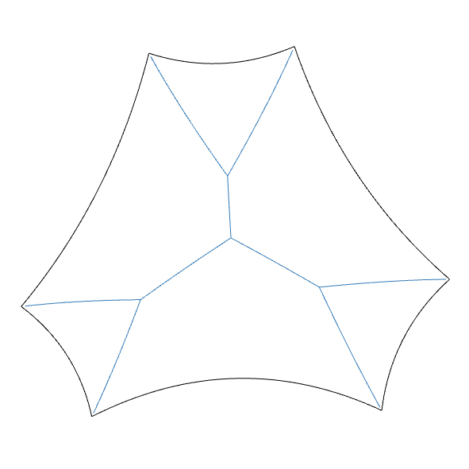
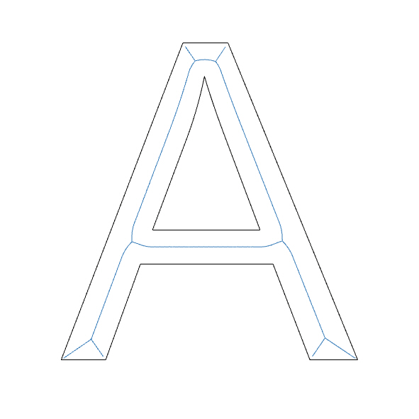
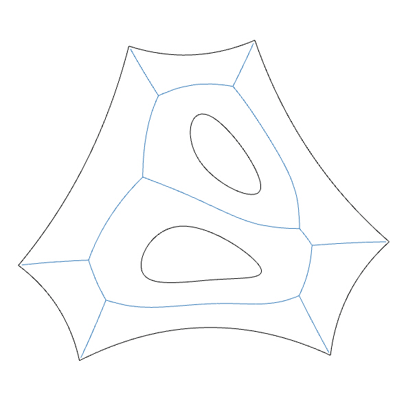
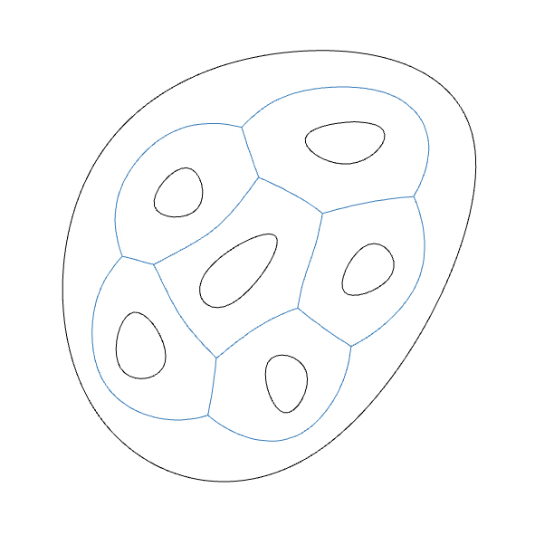
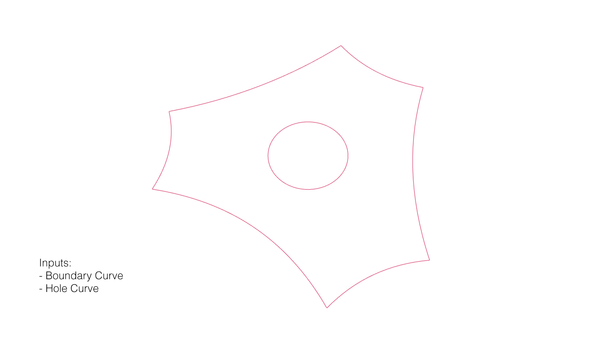
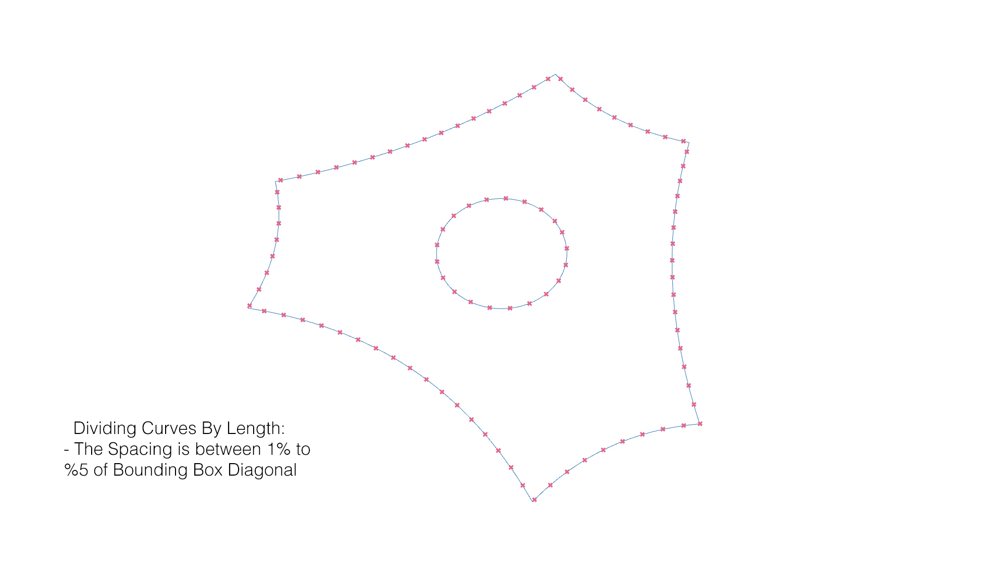
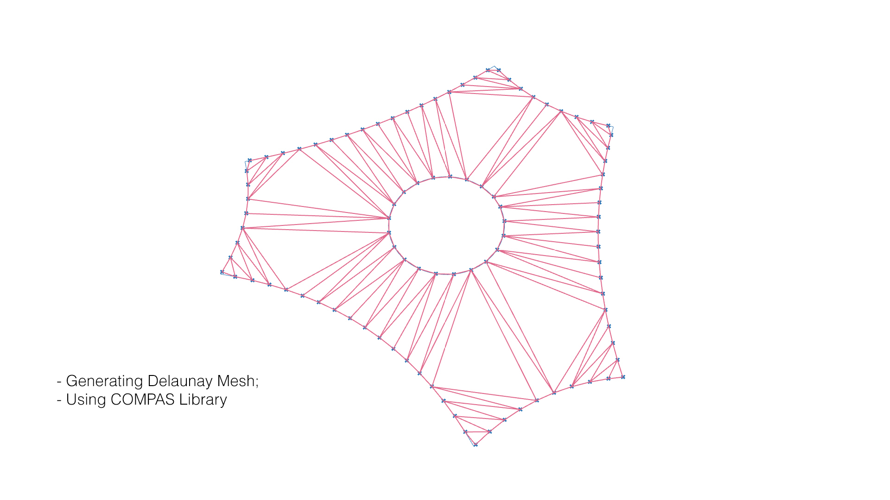
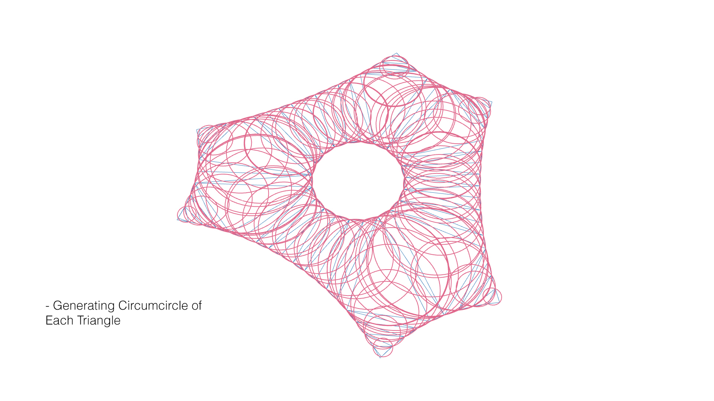
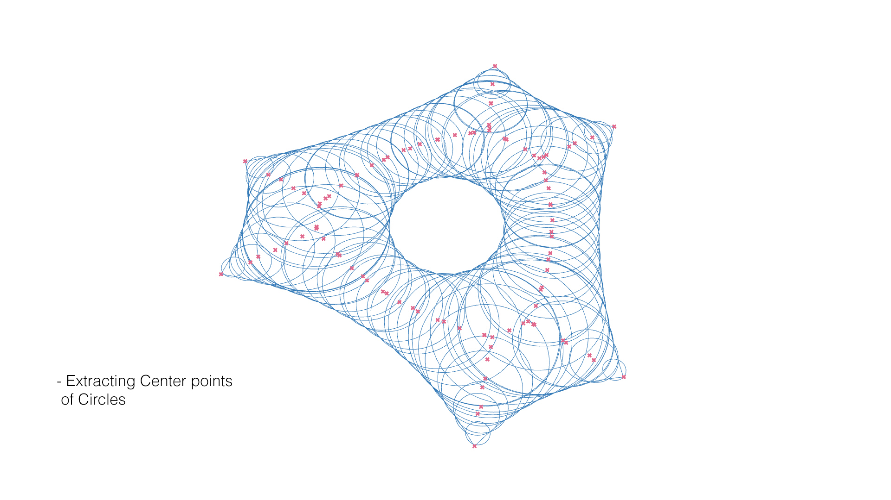
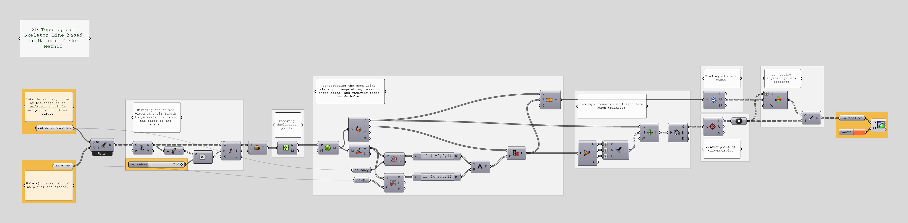

# Topological-skeleton
Topological skeleton based on maximal disks method in Grasshopper

In shape analysis, skeleton (or topological skeleton) of a shape is a thin version of that shape that is equidistant to its boundaries. The skeleton usually emphasizes geometrical and topological properties of the shape, such as its connectivity, topology, length, direction, and width. Together with the distance of its points to the shape boundary, the skeleton can also serve as a representation of the shape (they contain all the information necessary to reconstruct the shape).

- more information on topological skeleton: [Wikipedia page](https://en.wikipedia.org/wiki/Topological_skeleton)

- This code is developed as part of the project [Shell tessellation pattern](http://www.iaacblog.com/programs/shell-tessellation-patterns/).

|               |                |               |                |
| ------------- | -------------- | ------------- | -------------- |
|  |  |   |  |

## Requirements
* Rhinoceros 5 or later.
* Grasshopper 3d plugin for Rhinoceros.
* Sandbox plugin for grasshopper.

`This code has been tested on Rhinoceros on windows`

## Getting started
- You can use the .gh file from scripts folder with the following instruction:
  - Defining Boundary curve of the shape to analyze.
  - Defining Hole curve(s) of the shape. if there are any.

## Workflow
- In the following diagrams, you can see the processes to define smaller patches from a given boundary curve and a hole curve.

|               |                |               |
| ------------- | -------------- | ------------- | 
|1. Defining Boundary curve and Hole Curve.  | 2. Generating points on the edges. | 3. Generating initial mesh.  |
|4. Generating circumcircle of each face.  | 5. Extracting center points of each circle. |6. Connecting the points based on face adjacency.  |

- Grasshopper definition

## References
- [Shell tessellation pattern on iaacblog](http://www.iaacblog.com/programs/shell-tessellation-patterns/)
- Computational Tessellation of Freeform, Cut-Stone Vaults – Rippman, Block – June 2018
- Patterns for Masonry Vault Design – Robin Oval, Rippman – Sep. 2017
- Digital Stereotomy: Voussoir geometry for freeform masonry-like vaults informed by structural and fabrication constraints – Rippman, Block – 2011
- New Design and Fabrication Methods for Freeform Stone Vaults Based on Ruled Surfaces
- Form Finding to Fabrication: A digital design process for masonry vaults

## Credits
__Topological skeleton__ is a project of IaaC, Institute for Advanced Architecture of Catalonia, Developed at __Master in Robotics and Advanced Construction (MRAC)__ in __2018-2019__ during __Software I Seminar__ by:

Student: __Soroush Garivani__

Faculty: __Long Nguyen__
